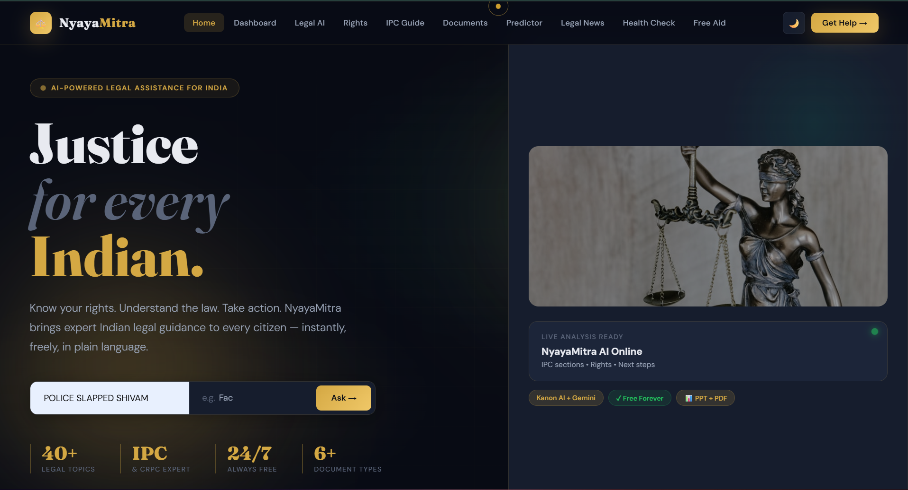
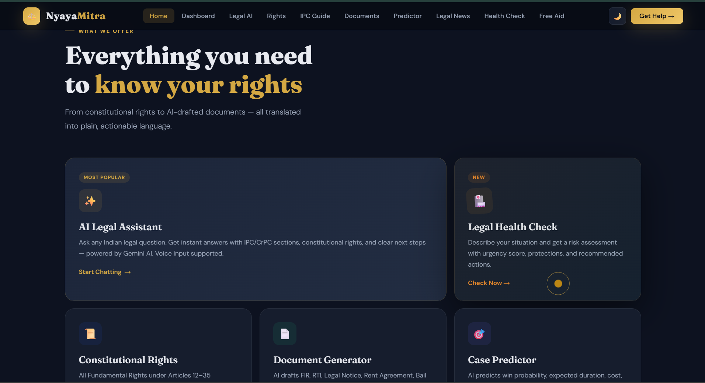
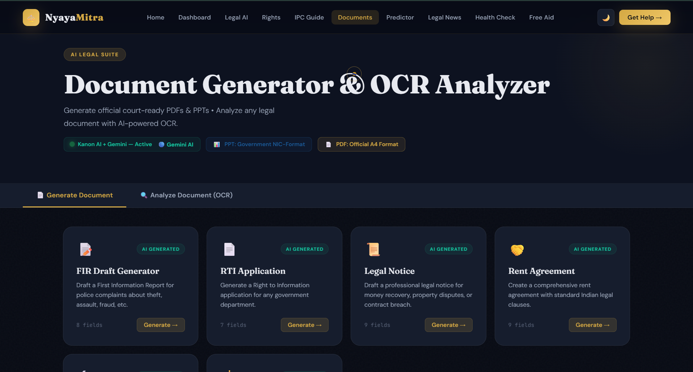
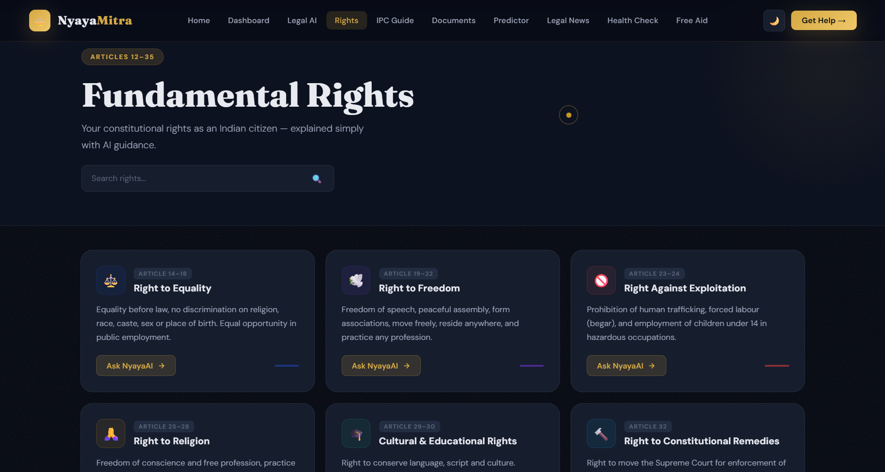

<div align="center">

# ⚖️ NYAYA AI

### *Your AI-Powered Legal Assistant — Know Your Rights, Generate Documents & Predict Case Outcomes*


<br>

> **Legal knowledge should be accessible to everyone—not just lawyers. NYAYA AI empowers every citizen with AI-driven legal assistance, document generation, and constitutional guidance.**

</div>

---

# 📌 About NYAYA AI

NYAYA AI is an AI-powered legal platform designed to simplify legal awareness for everyone.

Whether you want to:

- 💬 Ask legal questions
- 📄 Generate legal documents
- ⚖️ Learn your constitutional rights
- 🤖 Predict possible case outcomes

NYAYA AI makes legal information simple, accessible, and available 24×7.

---

# ✨ Features

## 🤖 AI Legal Assistant

- Natural language conversations
- Instant legal guidance
- Multi-language support

---

## 📚 Constitutional Rights

- Fundamental Rights
- Directive Principles
- Important Articles
- Searchable legal knowledge

---

## 📄 Legal Document Generator

Generate documents like:

- FIR Draft
- Bail Application
- Legal Notice
- Complaint Letter
- Affidavit

---

## ⚖️ Case Outcome Prediction

- AI-powered analysis
- Data-driven insights
- Understand possible legal outcomes

---

## 🌍 Multi-language Support

Supports multiple Indian languages for better accessibility.

---

# 🖥️ Application Screenshots

## 🏠 Landing Page

<p align="center">

</p>

---

## 📊 Dashboard

<p align="center">

</p>

---

## 📄 Document Generator

<p align="center">

</p>

---

## 📚 Constitutional Rights

<p align="center">

</p>

---

# 🛠 Tech Stack

| Category | Technology |
|-----------|------------|
| Frontend | React, TypeScript, Tailwind CSS |
| Backend | Node.js, Express |
| AI | OpenAI / Gemini API |
| Database | Drizzle ORM |
| Validation | Zod |
| Build Tool | Vite |
| Package Manager | pnpm |

---

# 🚀 Installation

```bash
git clone https://github.com/swayamgupta592006-gif/NYAYA-AI-MAIN.git

cd NYAYA-AI-MAIN

pnpm install

pnpm dev
```

---

# 📂 Project Structure

```
NYAYA-AI-MAIN
│
├── artifacts/
├── lib/
│   ├── db/
│   ├── api-client-react/
│   └── api-zod/
│
├── scripts/
├── index.html
├── package.json
├── tsconfig.json
├── pnpm-workspace.yaml
└── README.md
```

---

# 🌟 Why NYAYA AI?

✅ AI-powered legal assistant

✅ Constitutional rights guide

✅ Instant legal document generation

✅ Case outcome prediction

✅ Multi-language support

✅ Easy-to-use interface

---

# 🚀 Future Enhancements

- Voice Assistant
- OCR for Legal Documents
- Court Case Tracking
- Lawyer Consultation
- PDF Export
- Mobile App
- Regional Language Expansion

---

# 👨‍💻 Author

## Swayam Gupta

GitHub

https://github.com/swayamgupta592006-gif

---

<div align="center">

## ⭐ Star this repository if you found it useful!

### Making legal knowledge accessible to every citizen through AI.

Made with ❤️ by **Swayam Gupta**

</div>
